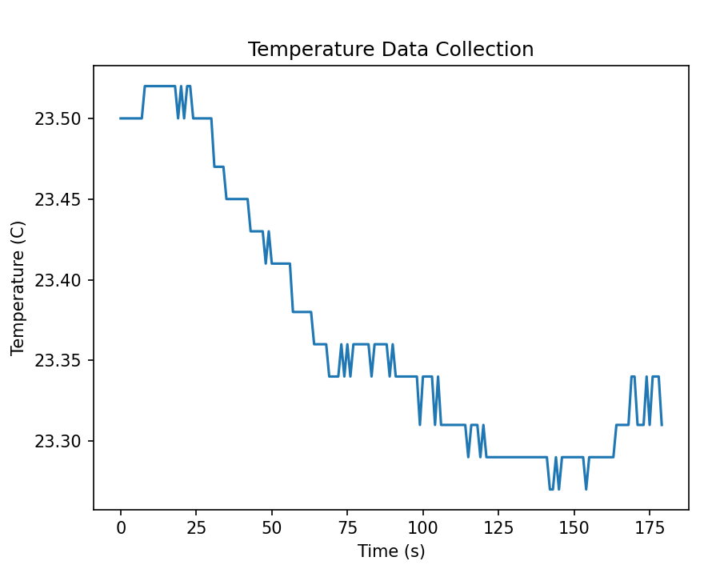
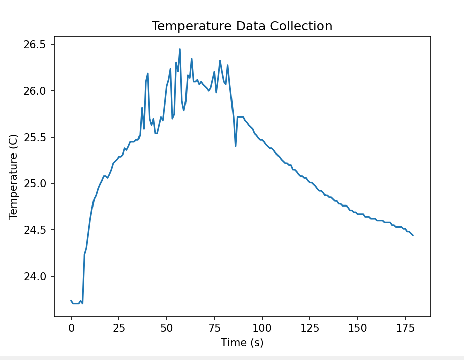
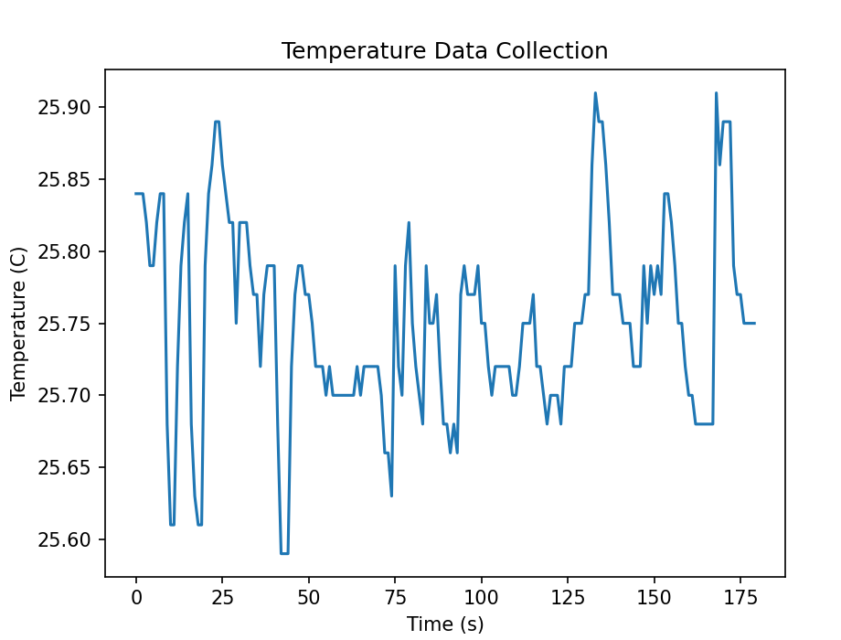
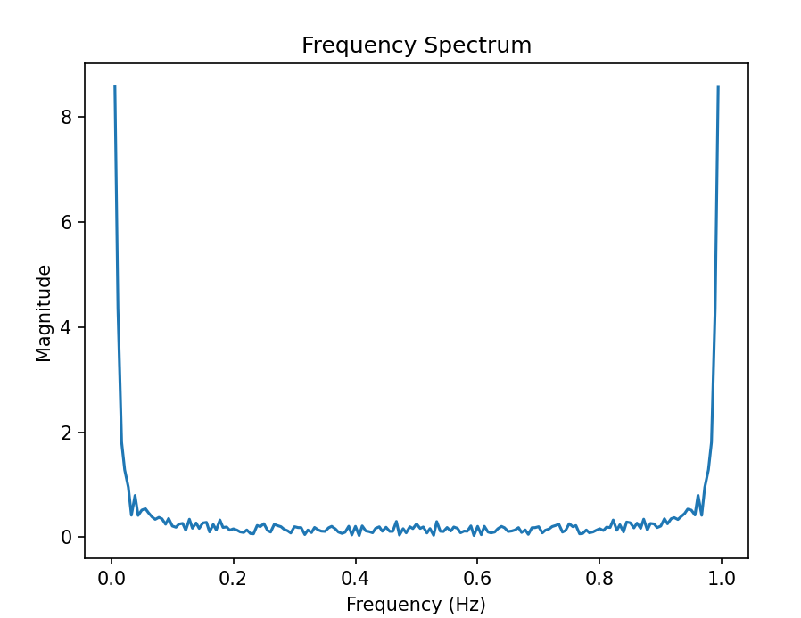
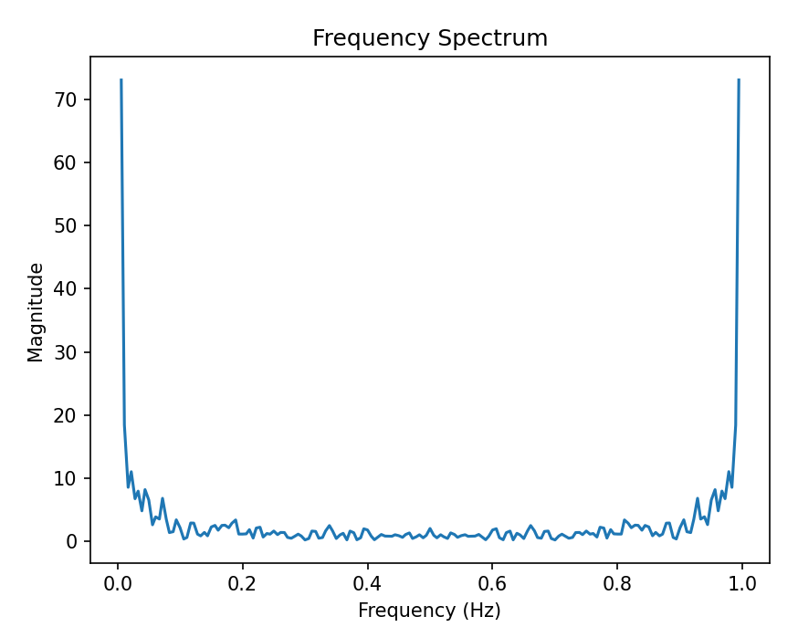
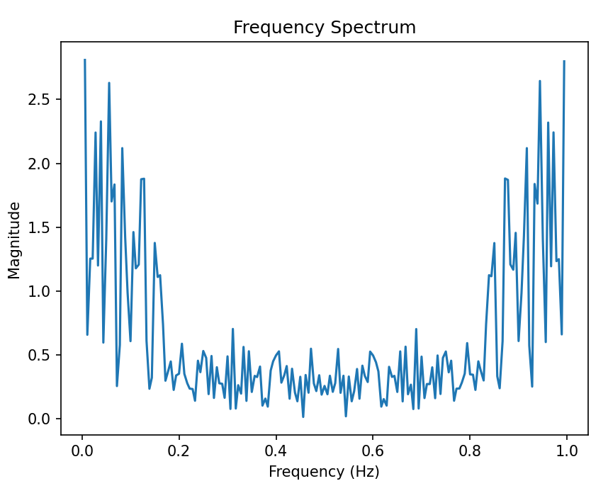

# **Discussion of Data Analysis shown in Task 4**
# *Intro*
I decided to analyse two versions of my two data sets. One in a stable control environment where I left the temperature sensor to record the natural temperature of the room, and another where I intentionally heated the sensor. Then finally I made another data set where I periodically heated and cooled the sensor as it measured.

I will discuss the Temperature/Time and Frequency/Magnitude graphs in this file, and the other graphs can be seen from running the code in "plot_data.py".

# *Temperature vs Time*

*Data Set 1*

This data set was left naturally so it has a very low range and so the graph may seem more "jumpy" since it has a lower apparent resolution than the other graphs (when in actuality the resolution is the same but just relatively bigger in comparison to the range). 

*Data Set 2*

Data Set 2 was purposefully heated so it has a much larger range of temperatures. So it has a period of high fluctuation as its being heated (and it seemed much less stable or more noisy during this period) then a slow, smoother cooling afterwards.

*Data Set 3*

For Data Set 3, I tried to heat and cool the sensor periodically to create a high fluctuation. This led to a very noisy and unstable graph.

# *Frequency vs Magnitude*

*Data Set 1*

Data Set 1 had very little fluctuation, so the dominant frequency is very low as seen here (only the first half of the graph needs to be considered as it is mirrored after 0.5), meaning there was very little to no periodic fluctuation.

*Data Set 2*

This data set had more fluctuation, so the dft has slightly more noise with higher frequencies, however not enough to argue a higher dominant frequency for this data. 

*Data Set 3*

The final data set has much more noise in the higher frequencies as it had much more periodic fluctuation. It has several high peaks below 0.2Hz and still significant noise above that, suggesting there are many components of periodic fluctuation in this data. Its highest peak that isnt close to zero is at around 0.05Hz, which would suggest one fluctuation every 20 seconds. Relating this to the temp/time graph this seems logical and was the frequency I was aiming to replicate with my heating and cooling.